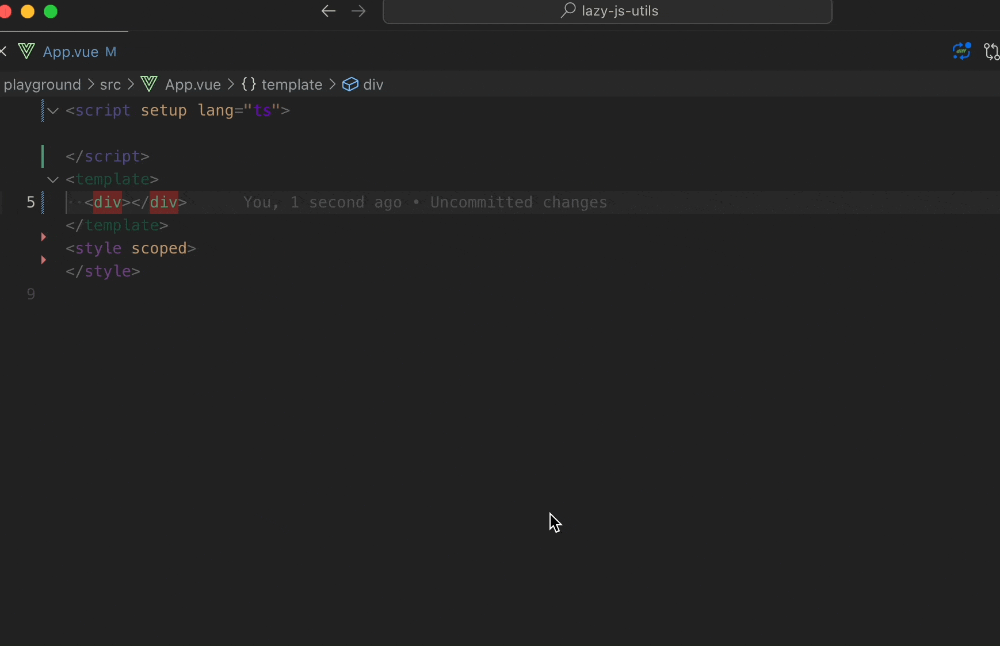
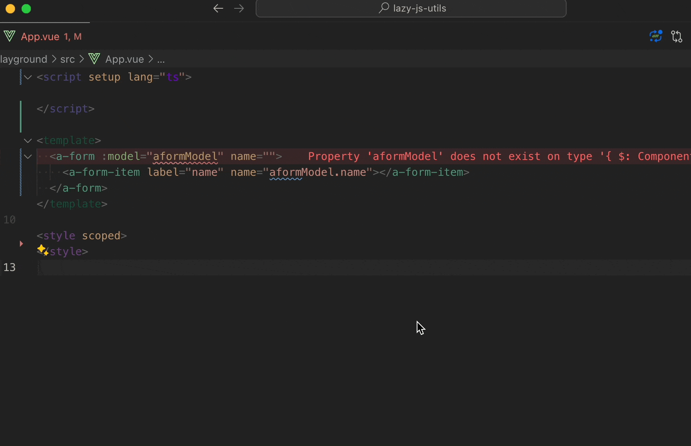

## 什么是 fast-create-variable

- 是一个解决在 *vue*、*svelte*、*react*、*typescript*、*javascript* 中快速创建变量的 `vscode` 插件

## 为什么要写 fast-create-variable❓

- 苦于项目中每次新增业务逻辑, 在视图和变量中反复滚动, 为了解决这个痛点, 我写了这个插件

## fast-create-variable 的优点 💯

1. 很多人都有维护老项目的经历吧, 在 vue2 项目中, 很轻易就能看到一个 `.vue` 文件存在上千行的代码量, 甚至更多, 如果你每次去找模板加了一个变量, 需要在 `data` 中定义初始化数据, 然而在几千行代码来回滚屏去做这件事, 是很让人恼火的, 我可能真正有效的 coding 时间不多, 时间全浪费在找 data 和 找模板中的变量位置, `fast-create-variable` 能够让你直接在模板中选中变量名, 通过快捷键去创建变量插入到对应的位置, 还节约了你重新复制粘贴或者手动敲变量名的成本, 当然如果你使用的是 `jsx` 或者 `setup` 等语法, 也是支持的, 并且会贴心的给你倒入 `import` 语句, 可以查看 👇 的事例

2. 它不仅仅是让你选择类型和传入变量名去创建变量, 它会更加智能的推断, 比如你当前的选择区域前缀是 `id` 或 `class`, 它会判断你大概率要创建 `css`, 所以它默认选中了 `scoped css`, 比如你前缀是 `on` 或 `@`, 则推断是事件, 如果你当前是 `ts` 环境, 还会提供一个推断的类型, 另外如果变量名重复创建, 会有弹窗的警告, 防止你重复创建变量, 所以很大程度上, 你完成创建变量的步骤就是, 在模板中写好变量名, 选中变量名, 这时候光标也在啊变量名上, 然后快捷键, 去告诉插件要创建变量, 然后推断都合理的情况下, 一路回车 2 下, 就完成了变量的创建, 然后再通过 `ctrl + -` 回到之前模版的光标位置, 继续开发

3. 它会智能的合并对象, 当你创建一个表单项的变量, 你可能当时创建了表单的 `name`, 但是在后来的需求上, 你的视图上需要加上更多的字段, 你可以直接在 `<FormItem :name="form.name"/>`, 后面追加完多选 `name` 后的内容, 比如 `form.age`、`form.pwd`, 可以一键直接创建多个同一大对象的属性, 可以查看 👇 的事例

4. 默认情况下, 它是不需要你去选中变量名的, 因为它做了特殊处理去匹配, 节约了你双击的过程, 甚至向上面表单的场景, 你需要选中 `form.xx`, 然后事件中整个函数体, 因为你可能需要它给出函数的接收参数, 你不得不提供函数的完整信息, 你只需要光标在函数最后的 `}` 后, 它会自动识别你的函数体, 为你提供函数的参数

#### 看完了以上的信息，如果你觉得它真的有打动到你，还不快快体验一下，可以帮我点一个 [star 🌟](https://github.com/Simon-He95/fast-create-variable) 和 [赞助我一杯 ☕️](https://github.com/Simon-He95/sponsor)，我希望这个插件，能够帮助你带来 `10` 倍的开发效率，超级的开发体验 :)
