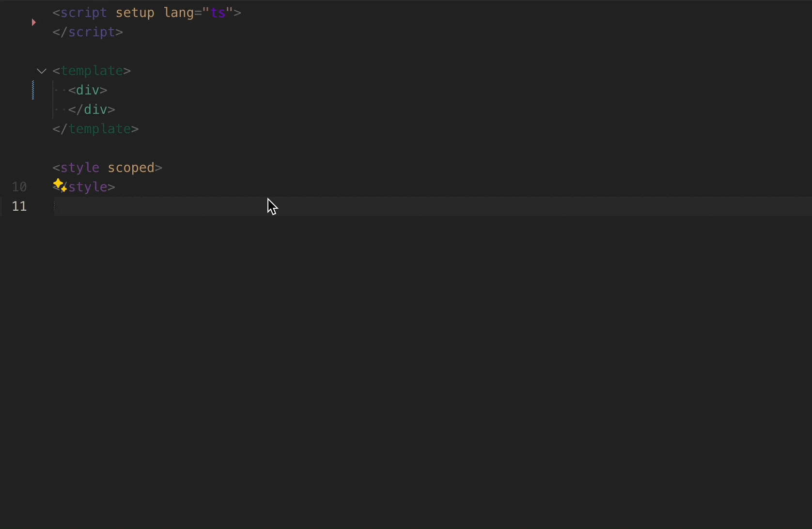

[[toc]]

> [英文 English Version](/posts/vscode-tailwind-magic)

## 什么是 vscode-tailwind-magic

- 是一个解决 `TailwindCss` 写法上痛点的 `vscode` 插件

## 为什么要写 vscode-tailwind-magic❓

- 为了对齐 `UnoCSS` 的生态, `UnoCSS` 有 `transformer-variant-group`、`transformer-attributify`, 然而 `TailwindCss` 就没有这种优势

## vscode-tailwind-magic 的优点 💯

1. 它能让你在属性上写 `tailwind` 的语法, 它能带保留`语意化`: 因为 `UnoCSS` 的这些 vite-plugin 带来的简写方式, 会丢失一部分开发者直观解读出属性的意义, 因为项目很多情况下是协同开发, 你自定义一个 `variant`, 我来一个 `shortcuts`, 你请假了, 我来读你的 `shortcuts`, 我会很懵逼, 这是啥, 我要借助 `Unocss` 的 vscode 插件 hover 才能知道转换后的 css 结果, 这里已经做了一次额外的事情了, 它带来了不直观, 所以我在设计上是想保留原本 tailwind 的语法, 因为这是规范, 即使今天有一个新人来, 它学习参考的是 tailwind 的官网, 而不是你个人二次定制化的东西, 它会带来更大的学习成本

2. 它比 `Unocss` 更加简化, 是一个 `UnoCSS` 写法上的超级, 因为 `UnoCSS` 的 `vite-plugin`, 是没有引入 parser 的, 所以它能力有局限, 没办法带来更加精准的控制, 它的属性模式支持能力也是有限的, 而 `vscode-tailwind-magic` 能打破传统 `parser` 的限制, 突破 `jsx` 的束缚, 即使在 `jsx` 语法层面的爆红, 你在插件的能力下仍然能支持转换, 你在 `UnoCSS` 没办法做到 `
`, 你只能这样写 `
` 或者 `
` 但是 `vscode-tailwind-magic` 则可以这样写 `
`, 因为它会被转换成 `
`

3. 由于 `UnoCSS` 和 `TailwindCSS` 出于原子化考虑复用性的最大化, 属性拆分细粒度很小, 不能做到特别好的开发体验优化, 举一个例子, 我写了 `flex-col` , 难倒它会脱离 `flex` 存在吗? 你必须要 `flex flex-col`, 它才能生效, 更有 `border-#eee`, 你是看不到 border 的样式的, 为什么呢? 因为你需要配置 `border` 的 `宽度`, 配置是否是 `solid` 或者 `dash` 等等的东西, 才能看到你以为的边框, 为什么不直接给个默认的 `solid` 和 `1` 像素的边框呢 ? 这也就是我说的出于最大化复用的一个痛点, 而 `vscode-tailwind-magic` 能弥补这一点, 因为我是站在开发者的角度去设计它的, 所以我希望, 我如果给到更加细节的一个属性的时候，能自动带出它相关联的必要属性, 就是前面举的那些例子说的情况还有更多, 虽然这些配置是出于我个人主观的默认设置,你可能觉得, 这不是相当于你个人的 `shortcuts` 了吗? 并不是这样子的，因为它也可以是你个人的 `shortcuts`, 它是支持每个人配置自己的规则, 唯一不同的是无论你个人怎么配置，但是所有人最终都遵循了 `Tailwind` 官网的规范，保留了语意化, 而不是个人定制化的东西, 举一个例子，你可以配置 `tc` 你个人感觉的 `shortcuts`, 但是最终，被所有开发者看到的是你写了 `class="text-center"`

4. 这里顺便说一下，有的人很不喜欢 `attributify` 模式, 虽然它的写法简单，不局限于我一定要写在 `class` 或 `className` 中，很自由，但是 `UnoCSS` 的属性模式并没有强大的到支持所有的写法，所以，对于特殊情况，你仍然要写 `class`, 所以就出现了大批 `class` 和 `attributify` 混用的情况，会更加不直观的维护，因为属性会有的在前面有的在后面，中间可能夹杂了其他组件的传递属性，就比如 `<my-comp w-10px comp-prop="xxx" h-10 class="bg-#eee" text-center />` ,但是 `vscode-tailwind-magic` 它满足了任意位置用属性的方式写，但是最终会转换成对应的 `class` 或 `className`, 它会变成`<my-comp comp-prop="xxx" class="w-[10px] h-10 text-center bg-[#eee]" />`

## 演示 Gif

你可以通过它的[测试文件 📃](https://github.com/Simon-He95/vscode-tailwind-magic/blob/main/test/index.test.ts)，看到它的写法和能做到的事情～

#### 看完了以上的信息，如果你觉得它真的有打动到你，还不快快体验一下，可以帮我点一个 [star 🌟](https://github.com/Simon-He95/vscode-tailwind-magic) 和 [赞助我一杯 ☕️](https://github.com/Simon-He95/sponsor)，我希望这个插件，能够帮助你带来 `10` 倍的开发效率，超级的开发体验 :)

